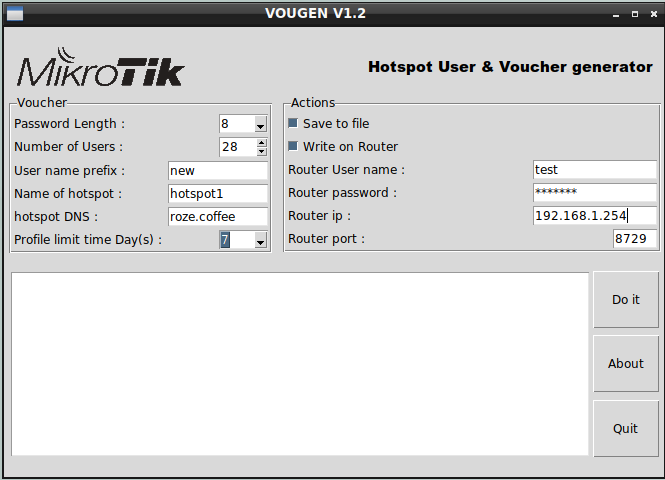
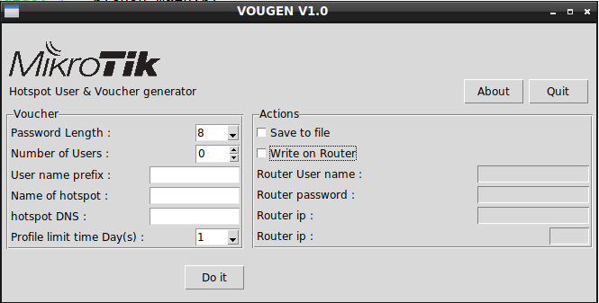

# vougen
The application for to create Mikrotik hotspot user &amp; voucher . Built on python3 and tkinter.

You maybe like this (Raspberry Pi Version) too https://github.com/scriptik/vougenpi 
 
With this application you can create the Hotspot users and save it as the .rsc file or write 
directly on the Mikrotik Router .Also it create the voucher for you with the QR code as this.

# Running
Simply run python main.py
in the main menu fill the fileds as the below sample

if the router is not avilable now you can save the out put in the .rsc file and don't 
select Write on router checkbox.

# Connecting to Router
For api-ssl connection , Before connecting, api-ssl service on routeros must have a valid certificate set. For more information on 
how to generate such certificates see :
[MikroTik wiki](https://wiki.mikrotik.com/wiki/Manual:Create_Certificates)
# ToDo-List
- [ ] Add api-ssl connection button and active it for new API

# Built with
  Python API client for RouterOS that is easy to use and modify. 

  Pure python QR Code generator

 ReportLab PDF Toolkit
